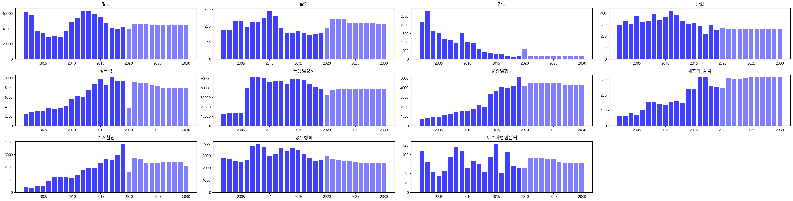
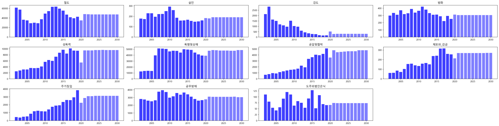
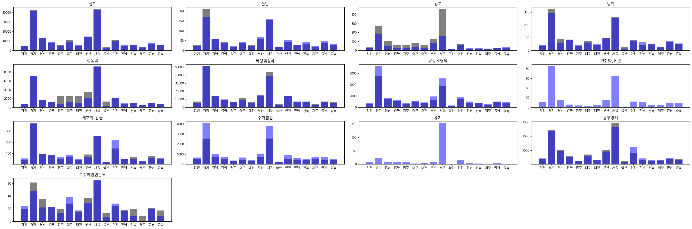

# 경찰/파출소 수 및 지역적 특색을 갖는 요소들과 범죄의 상관관계

## 팀원

1. 팀장
   - 백승현
1. 팀원
   1. 김현석
   1. 이재형
   1. 이재성

## 디렉토리 구조

1. [코드](./code)
   - 전처리, 모델링 , 시각화 등 실제 구현한 파이썬 코드들
1. [데이터](./data)
   - 분석하면서 필요한 데이터 및 프로세스를 진행하면서 추출된 데이터
1. [이미지](./img)
   - 모델링 과정의 데이터를 시각화한 이미지파일

## 목차

1. [`지역적 사회적 요소를 이용하여 범죄 예측 개요`](##개요)

   1. [과제 정의](###과제정의)
   1. [분석 프로세스](###과제프로세스)

1. [데이터 품질 및 분석 단위 정의](##데이터)

   1. [데이터셋 목록 (출처, 데이터명, 컬럼명, 데이터시작지점, 최종지점, 수집주기 등)](###데이터셋)
   1. [데이터 품질 확인](###데이터품질)
   1. [대상 데이터 선정 (선정 과정, 이유)](###데이터선정)

1. [모델 개발](##모델_개발)

   1. [데이터 전처리 및 파라미터 전처리](###데이터&파라미터_전처리)
   1. [파라미터 구성 (파라미터 목록 정리 표)](###파라미터_구성)
   1. [학습데이터 구축](###학습데이터_구축)
   1. [머신러닝 학습](###머신러닝_학습)
   1. [모델 학습 결과](###모델_학습-결과)
   1. [검증 방안](###검증_방안)
   1. [고도화를 위한 연구](###고도화를_위한_연구)

1. [모델운영 방안](##모델운영_방안)

## 개요

### 과제정의

본 과제는 2021년 혁신성장 청년인재 집중양성 빅데이터 분석가 양성과정 고려대학교 세종캠퍼스반 1조의 산학 프로젝트 과제이다. 데이터는 공간적·인구적·사회적 특성을 기준으로 범죄에 영향을 미칠 것으로 예상되는 요소들을 `Kosis`와 `LocalData` 등에서 수집해서 활용하였다. 머신러닝을 이용하여 범죄 발생 요인에 따른 범죄 예측 모델을 구현했으며, 이를 통해 시도 및 연도에 따른 범죄 수를 예측하였다.

### 과제프로세스

## 데이터

### 데이터셋

1. 데이터 목록 (※ 별첨\_설계보고서\_별첨\_01.csv)
   | 활용 | 파일명 | 시작 시점 | 최종지점 | 수집주기 | 기준일 |
   | -------------------------------------------- | -------------------------------------------------- | --------- | -------- | -------- | ------ |
   | 범죄 발생 건수 집계 | crime_location.csv | 2010 | 2020 | 1년 | 2021 |
   | 사회적 요소 집계 | income_level_by_region.csv | 2000 | 2019 | 1년 | 2021 |
   | 사회적 요소 집계 | economic_activity_by_region.csv | 2000 | 2020 | 1년 | 2021 |
   | 사회적 요소 집계 | police_officer_num_by_region.csv | 2009 | 2017 | 1년 | 2021 |
   | 인구적 요소 | population_by_region.csv | 1992 | 2020 | 1년 | 2021 |
   | 인구적 요소 | population_movement_by_region.csv | 2001 | 2020 | 1년 | 2021 |
   | 인구적 요소 | 외국인\_거주자.csv | 2003 | 2020 | 1년 | 2021 |
   | 공간적 요소 집계 | local_data.csv | 2000 | 2020 | 1년 | 2021 |
   | 공간적 요소 집계 | universities_by_region.csv | 2003 | 2020 | 1년 | 2021 |
   | 기타 요인 | 시도*산업*조직형태별*사업체수*종사자수.csv | 2000 | 2019 | 1년 | 2021 |
   | 기타 요인 | number_of_psychotropic_drug_requests_by_region.csv | 2010 | 2020 | 1년 | 2021 |

---

### 데이터품질

`보유 데이터 예시`

1. crime_location.csv

   | 년도 | 시도 | 절도  | 장물 | 사기  | 횡령 | 배임 | ... |
   | ---- | ---- | ----- | ---- | ----- | ---- | ---- | --- |
   | 2002 | 강원 | 2246  | 8    | 3317  | 346  | 60   | ... |
   | 2002 | 경기 | 23520 | 138  | 21161 | 2748 | 486  | ... |
   | 2002 | 경남 | 7361  | 35   | 9180  | 940  | 183  | ... |

1. 시도\_산업\_조직형태별\_사업체수\_종사자수.csv

   | 년도 | 시도 | 종교단체수 |
   | ---- | ---- | ---------- |
   | 2000 | 서울 | 8765       |
   | 2000 | 부산 | 2852       |
   | 2000 | 대구 | 1806       |
   | 2000 | 인천 | 3100       |
   | 2000 | 광주 | 1334       |

1. 외국인\_거주자.csv

   | 년도 | 시도       | 외국인수 |
   | ---- | ---------- | -------- |
   | 2003 | 서울특별시 | 102882   |
   | 2003 | 부산광역시 | 19823    |
   | 2003 | 대구광역시 | 15267    |
   | 2003 | 인천광역시 | 31084    |
   | 2003 | 광주광역시 | 4921     |

1. universities_by_region.csv

   | 년도 | 시도           | 대학교 수 | 일반대 수 | 전문대 수 | 교육대 수 | 산업대 수 |
   | ---- | -------------- | --------- | --------- | --------- | --------- | --------- |
   | 2003 | 서울특별시     | 52        | 38        | 12        | 1         | 1         |
   | 2003 | 제주특별자치도 | 6         | 2         | 3         | 1         |           |
   | 2003 | 인천광역시     | 10        | 4         | 5         | 1         |           |
   | 2003 | 충청남도       | 24        | 13        | 8         | 1         | 2         |
   | 2003 | 부산광역시     | 23        | 11        | 10        | 1         | 1         |
   | 2003 | 전라남도       | 23        | 10        | 11        | 2         |

1. number_of_psychotropic_drug_requests_by_region.csv

   | 년도 | 시도 | 향정신성의약품 청구건수 |
   | ---- | ---- | ----------------------- |
   | 2010 | 강원 | 1255858                 |
   | 2010 | 경북 | 2319699                 |
   | 2010 | 전남 | 1740075                 |
   | 2010 | 충북 | 1505422                 |
   | 2010 | 충남 | 1881694                 |

1. divorce_rate_by_region.csv

   | 년도 | 시도           | 이혼율 |
   | ---- | -------------- | ------ |
   | 2000 | 서울특별시     | 2.5    |
   | 2000 | 제주특별자치도 | 3.3    |
   | 2000 | 경상남도       | 2.3    |
   | 2000 | 경상북도       | 2      |
   | 2000 | 전라남도       | 2.1    |

1. police_officer_num_by_region.csv

   | 년도 | 시도           | 경찰청 소속 경찰관 수 | 경찰청 인원 1명당 담당 인구 |
   | ---- | -------------- | --------------------- | --------------------------- |
   | 2009 | 서울특별시     | 24841                 | 421.2411                    |
   | 2009 | 제주특별자치도 | 1359                  | 417.8904                    |
   | 2009 | 경상남도       | 5515                  | 589.3338                    |
   | 2009 | 경상북도       | 5456                  | 489.3468                    |
   | 2009 | 전라남도       | 4886                  | 391.5276                    |

1. population_movement_by_region.csv

   | 년도 | 시도           | 총전입 (명) | 총전출 (명) | 순이동 (명) | 시도내이동-시군구내 (명) | ... |
   | ---- | -------------- | ----------- | ----------- | ----------- | ------------------------ | --- |
   | 2001 | 서울특별시     | 691659      | 656286      | 35373       | 129305                   | ... |
   | 2001 | 제주특별자치도 | 31772       | 32973       | -1201       | 10409                    | ... |
   | 2001 | 경상남도       | 146484      | 156047      | -9563       | 45818                    | ... |
   | 2001 | 경상북도       | 134997      | 150754      | -15757      | 44581                    | ... |
   | 2001 | 전라남도       | 118056      | 141057      | -23001      | 32980                    | ... |

1. economic_activity_by_region.csv

   | 년도 | 시도     | 경제활동인구 | 비경제활동인구 | 취업자  | 고용률 (%) | 실업자 | 실업률 (%) |
   | ---- | -------- | ------------ | -------------- | ------- | ---------- | ------ | ---------- |
   | 2000 | 경상남도 | 1411000      | 900000         | 1361000 | 58.9       | 49000  | 3.5        |
   | 2000 | 경상북도 | 1415000      | 756000         | 1368000 | 63         | 48000  | 3.4        |
   | 2000 | 전라남도 | 1014000      | 568000         | 981000  | 62         | 33000  | 3.3        |
   | 2000 | 충청남도 | 917000       | 542000         | 892000  | 61.1       | 26000  | 2.8        |
   | 2000 | 충청북도 | 691000       | 459000         | 666000  | 57.9       | 25000  | 3.6        |

1. icome_level_by_region.csv

   | 년도 | 시도       | 1인당 지역내총생산 | 1인당 지역총소득 | 1인당 개인소득 | 1인당 민간소비 |
   | ---- | ---------- | ------------------ | ---------------- | -------------- | -------------- |
   | 2000 | 서울특별시 | 16383              | 17194            | 9978           | 8202           |
   | 2000 | 부산광역시 | 9790               | 10933            | 8296           | 7567           |
   | 2000 | 대구광역시 | 9195               | 10684            | 8274           | 7732           |
   | 2000 | 인천광역시 | 11875              | 10633            | 7651           | 7248           |
   | 2000 | 광주광역시 | 9862               | 10770            | 7969           | 7509           |

1. population_by_region.csv

   | 시도       | 년도 | 한국인 총인구수 [명] | 한국인 남자인구수[명] | 한국인 여자인구수[명] | 한국인 남녀비율 [백분율] | 한국인 (인구밀도) |
   | ---------- | ---- | -------------------- | --------------------- | --------------------- | ------------------------ | ----------------- |
   | 경기도     | 1992 | 6613094              | 3343088               | 3270006               | 102.2349                 | 650.1911          |
   | 인천광역시 | 1992 | 2065866              | 1042541               | 1023325               | 101.8778                 | 1943.43           |
   | 대전광역시 | 1992 | 1134843              | 572095                | 562748                | 101.661                  | 2102.34           |
   | 광주광역시 | 1992 | 1223784              | 606776                | 617008                | 98.34167                 | 2441.708          |
   | 대구광역시 | 1992 | 2284191              | 1144792               | 1139399               | 100.4733                 | 2585.389          |

1. local.csv

   | 시도   | 년도 | PC방 | 백화점 | 음식점 | 유흥가 |
   | ------ | ---- | ---- | ------ | ------ | ------ |
   | 경기도 | 2000 | 242  | 13     | 51928  | 6665   |
   | 경기도 | 2001 | 356  | 17     | 59259  | 7190   |
   | 경기도 | 2002 | 354  | 18     | 66777  | 7552   |
   | 경기도 | 2003 | 380  | 22     | 73701  | 7714   |
   | 경기도 | 2004 | 379  | 29     | 79652  | 7740   |

### 데이터선정

- 선정 이유
  1. 인구적 , 사회적 , 공간적 요소들이 범죄에 영향을 미칠 것으로 가정하고, 데이터를 수집하였습니다.
  1. 위 데이터들은 `Kosis` 및 `LocalData`에 존재하는 데이터 중 범죄와 연관성이 있을 것 이라는 판단을 한 데이터들을 수집하였습니다.

## 모델\_개발

### 데이터&파라미터\_전처리

1. Null값 (`결측치`) 처리
   - `경찰 수`,`향정신성 약물 처방자`와 같은 값에 결측치가 빈번히 보여 결측치 처리를 하였습니다.
     1. 0으로 채움
        - 각 값을 0으로 삽입하여 결측처리함.
     2. 평균으로 채움
        - 결측 부분을 각 칼럼의 전체 평균을 이용하여 삽입
     3. 선형회귀
        - 결측값을 Drop한 후 선형회기를 사용하여 예측하여 삽입.
1. 미래예측
   1. 종속변수 예측
      - Null값 처리를 한 데이터를 기반으로 선형회귀 예측을 하여 미래값을 예측하여 사용.
   1. 타겟 변수( 범죄)
      - 이중 결측값을 평균값으로 처리한 것이 가장 좋은 결과(`R2 점수는 높고`, `RMSE값이 낮음`)가 나와 평균값으로 채택
1. Train Test
   1. 타겟변수인 범죄 데이터가 `2002~2019`년도 데이터를 보유하고 있기 때문에 훈련시 종속변수 또한 2002~2019년도의 값만 추출하였습니다.
   1. 그 이후의 데이터(2020~2030 , 2020부터는 예측값 사용)는 Predict 데이터로 사용함
   1. `scikit learn`을 이용하여 train test 분할을 하였고, test는 `0.2`로 분할하였습니다.

### 파라미터\_구성

1.  종속변수

| 인구적 요소              | 사회적 요소                 | 공간적 요소 | 기타                    |
| ------------------------ | --------------------------- | ----------- | ----------------------- |
| 한국인(총인구수[명])     | 실업률 (%)                  | PC방        | 향정신성의약품 청구건수 |
| 한국인(남녀비율[백분율]) | 고용률 (%)                  | 백화점      | 종교단체수              |
| 한국인(인구밀도)         | 경찰청 소속 경찰관 수       | 음식점      |
| 외국인수                 | 경찰청 인원 1명당 담당 인구 | 유흥가      |
| 경제활동인구             | 1인당 지역내총생산          | 대학교 수   |
| 비경제활동인구           | 1인당 지역총소득            |
| 실업자                   | 1인당 개인소득              |
| 취업자                   | 1인당 민간소비              |
| 총전입 (명)              |
| 총전출 (명)              |

1.  독립변수

| 범죄데이터  |
| ----------- |
| 절도        |
| 살인        |
| 강도        |
| 방화        |
| 성폭력      |
| 폭행및상해  |
| 공갈및협박  |
| 약취와 유인 |
| 체포와 감금 |
| 주거침입    |
| 공무방해    |

### 학습데이터\_구축

1. 각 종속변수를 minmaxscaler를 이용하여 각 칼럼들을 스케일링 해줌.

### 머신러닝\_학습

1. 모델 선정

   1. 선형회기, XGBOOST, LASSO를 이용하여 파이프라인을 구성 후 R2 및 MSE등을 이용하여 점수 판단을 해본결과 `XGBOOST`가 가장 좋은 점수를 얻을 수 있어 선정함
   1. 생성된 점수표
      |Ls_r2_score| LS_rmse| rf_r2_score| rf_rmse| xgb_r2_score| xgb_rmse| crime| data_name|
      |-| -| -| -| -| -| -| -|
      |0.911434126| 4069.520205| 0.951718473| 3004.695734| 0.972108273| 2283.745497| 절도 |mean_predict.csv|
      |0.905810205| 15.06575709| 0.954333138| 10.49034134| 0.953019779| 10.64012092| 살인 |mean_predict.csv|
      |0.727742811| 193.7583627| 0.851704556| 142.9995536| 0.898776081| 118.1441853| 강도 |mean_predict.csv|
      |0.933302846| 23.0578709| 0.947956963| 20.36792886| 0.954581309| 19.02754948| 방화 |mean_predict.csv|
      |0.936367772| 447.4823114| 0.980489628| 247.782187| 0.98317505| 230.0987197| 성폭력 |mean_predict.csv|
      |0.927526746| 2900.130565| 0.968722591| 1905.215285| 0.96906596| 1894.728528| 폭행및상해 |mean_predict.csv|
      |0.868610256| 327.6530197| 0.946103795| 209.8517206| 0.962517576| 175.0037186| 공갈및협박 |mean_predict.csv|
      |0.698060656| 9.889383674| 0.769731069| 8.636286577| 0.304335602| 15.01098746| 약취와 유인 |mean_predict.csv|
      |0.851438391| 23.41083851| 0.935405636| 15.4369318| 0.935806863| 15.38891399| 체포와 감금 |mean_predict.csv|
      |0.856957844| 220.7529688| 0.9413914| 141.304243| 0.950568356| 129.7708226| 주거침입 |mean_predict.csv|
      |0.663431591| 12.3627295| 0.833582472| 8.69315104| 0.651327174| 12.58307375| 유기 |mean_predict.csv|
      |0.945689571| 195.5934918| 0.970272543| 144.7077078| 0.983989022| 106.1993159| 공무방해 |mean_predict.csv|
      |0.695699129| 13.28917402| 0.693461915| 13.33793544| 0.657809301| 14.09225495| 도주와범인은닉 |mean_predict.csv|
      |0.903753945| 4242.300935| 0.945591587| 3189.650001| 0.968241542| 2436.911222| 절도 |regression_predict.csv|
      |0.900591619| 15.47749017| 0.95784209| 10.07925825| 0.953864461| 10.54403495| 살인 |regression_predict.csv|
      |0.757577507| 182.8341152| 0.831187292| 152.5714754| 0.889666178| 123.3460112| 강도 |regression_predict.csv|
      |0.931889552| 23.30088525| 0.948777552| 20.20671508| 0.954162052| 19.11516886| 방화 |regression_predict.csv|
      |0.93399265| 455.7571141| 0.981317885| 242.465711| 0.984291567| 222.3329009| 성폭력 |regression_predict.csv|
      |0.953858863| 2314.050406| 0.977947663| 1599.764235| 0.975889091| 1672.767036| 폭행및상해 |regression_predict.csv|
      |0.859571872| 338.7353293| 0.953756687| 194.3828359| 0.960120343| 180.513277| 공갈및협박 |regression_predict.csv|
      |0.687583722| 10.05949549| 0.759082732| 8.833714064| 0.322010401| 14.81906793| 약취와 유인 |regression_predict.|csv
      |0.845471745| 23.87633272| 0.9379322| 15.13201793| 0.935298627| 15.44971313| 체포와 감금 |regression_predict.csv|
      |0.866862288| 212.9732575| 0.938627273| 144.5979845| 0.949495081| 131.1720691| 주거침입 |regression_predict.csv|
      |0.656438171| 12.49050923| 0.831561413| 8.745778744| 0.64545227| 12.68863914| 유기 |regression_predict.csv|
      |0.945990182| 195.0514303| 0.969744794| 145.9865477| 0.982955531| 109.5732429| 공무방해 |regression_predict.csv|
      |0.695235035| 13.29930394| 0.65939438| 14.05957833| 0.675054418| 13.73256646| 도주와범인은닉 |regression_predict.csv|
      |0.912251525| 4050.697319| 0.946660838| 3158.152494| 0.971139142| 2323.082444| 절도 |zero_predict.csv|
      |0.905970687| 15.05291703| 0.95665568| 10.22009973| 0.951891791| 10.76709715| 살인 |zero_predict.csv|
      |0.740989528| 188.9859158| 0.854275448| 141.754594| 0.898679475| 118.2005488| 강도 |zero_predict.csv|
      |0.932650044| 23.17043626| 0.950971449| 19.76924497| 0.954026603| 19.14339015| 방화 |zero_predict.csv|
      |0.942976238| 423.6090587| 0.978703947| 258.8730673| 0.983583418| 227.2891379| 성폭력 |zero_predict.csv|
      |0.934145946| 2764.521226| 0.969978052| 1866.586418| 0.968465215| 1913.038053| 폭행및상해 |zero_predict.csv|
      |0.878870999| 314.5991252| 0.95117583| 199.7334839| 0.961643037| 177.0335385| 공갈및협박 |zero_predict.csv|
      |0.7019474| 9.825526473| 0.768033814| 8.668056119| 0.30385334| 15.01618967| 약취와 유인 |zero_predict.csv|
      |0.842845116| 24.07839931| 0.942169937| 14.60630975| 0.935950622| 15.37167274| 체포와 감금 |zero_predict.csv|
      |0.860460946| 218.0330929| 0.937959378| 145.382657| 0.95172854| 128.2388886| 주거침입 |zero_predict.csv|
      |0.663492894| 12.36160356| 0.812983955| 9.215462267| 0.64776266| 12.64722916| 유기 |zero_predict.csv|
      |0.945848636| 195.3068529| 0.970641371| 143.8072136| 0.983372667| 108.2241236| 공무방해 |zero_predict.csv|
      |0.691185427| 13.38737054| 0.711760356| 12.93371382| 0.444046393| 17.96245392| 도주와범인은닉 |zero_predict.csv|

1. 학습 과정
   - GridSearchCV를 이용하여 각 범죄별 hyperParameter 튜닝 하여 각 범죄별 최적의 HyperParameter을 구하여 예측함.
1. 결과
   | colsample\*bytree | gamma | learning_rate | max_depth | min_child_weight | n_estimators | objective | subsample | crime |
   | ----------------- | ----- | ------------- | --------- | ---------------- | ------------ | ---------------- | --------- | -------------- |
   | 0.7 | 0 | 0.2 | 3 | 3 | 500 | reg:squarederror | 0.5 | 절도 |
   | 0.7 | 0 | 0.3 | 10 | 3 | 100 | reg:squarederror | 0.7 | 살인 |
   | 0.5 | 0 | 0.1 | 3 | 3 | 500 | reg:squarederror | 0.5 | 강도 |
   | 0.5 | 0 | 0.1 | 3 | 5 | 200 | reg:squarederror | 0.5 | 방화 |
   | 0.5 | 0.2 | 0.1 | 3 | 1 | 500 | reg:squarederror | 0.7 | 성폭력 |
   | 0.5 | 0.4 | 0.3 | 10 | 1 | 200 | reg:squarederror | 0.5 | 폭행및상해 |
   | 0.7 | 0 | 0.2 | 3 | 3 | 100 | reg:squarederror | 0.5 | 공갈및협박 |
   | 0.5 | 0 | 0.01 | 3 | 1 | 100 | reg:squarederror | 0.5 | 약취와\*유인 |
   | 0.7 | 0.2 | 0.1 | 3 | 3 | 500 | reg:squarederror | 0.5 | 체포와\_감금 |
   | 0.5 | 0 | 0.1 | 10 | 1 | 500 | reg:squarederror | 0.7 | 주거침입 |
   | 0.5 | 0 | 0.01 | 3 | 1 | 100 | reg:squarederror | 0.5 | 유기 |
   | 0.5 | 0.2 | 0.1 | 7 | 3 | 500 | reg:squarederror | 0.5 | 공무방해 |
   | 0.7 | 0.2 | 0.01 | 3 | 1 | 500 | reg:squarederror | 0.7 | 도주와범인은닉 |

### 모델\_학습-결과

1. 서울시 예측 결과 ( 모든 칼럼을 이용하여 예측 )
   
1. 상관계수 top5추출하여 예측
   

### 검증\_방안

1. 2002~2018의 데이터를 이용하여 2019년도를 예측한 데이터입니다.‘약취와 유인’, ‘유기’를 제외한 다른 범죄들은 예측이 잘 된 것으로 판단이 됩니다. 그리하여 최종적으로는 위 두 범죄를 추가로 제외하였습니다.
   

### 고도화를\_위한\_연구

1. 모든 칼럼을 이용하여 예측한 결과 모델의 실질적인 성능이 부족하여 각 칼럼별 상관계수가 높은 5개의 칼럼을 추출하여 사용함.

2. GridSearchCV를 이용하여 각 범죄별 hyperParameter 튜닝 하여 각 범죄별 최적의 HyperParameter을 구하여 예측함.

## 모델운영\_방안

         [Dash](code/Dash.ipynb)
